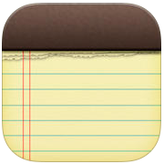

# Notes

A private, offline-first notes app for macOS. No cloud. No subscriptions. No data leaving your machine.

Built with Python and PySide6, packaged as a native `.app`.



---

## Features

### Notes
- Rich text editor with **bold**, *italic*, underline, and strikethrough
- Markdown-style tables and checklists
- Image and file attachments
- Notebooks to organize notes
- Pinned notes
- Full-text search
- Autocorrect

### Password Manager
- Store website credentials in an encrypted vault
- AES-128 encryption via Fernet, key derived with PBKDF2-SHA256 (260,000 iterations)
- Master password never stored — only a verifier hash
- Auto-locks when switching away from the password notebook
- Import passwords from CSV
- Built-in password generator

### Budget Tracker
- Log transactions with amount, category, date, and description
- Mark expenses as fixed (rent, subscriptions) to exclude from averages
- Stats bar: balance, spent, remaining, daily average, projected end-of-month
- Visual breakdowns by category and by day (vertical bar charts)
- Per-month budget notes, stored as plain markdown

### AI (coming soon)
- Semantic search across all your notes using a local embedding model
- Chat interface powered by Ollama — no API keys, no external servers
- Retrieval-augmented generation (RAG) via ChromaDB
- Enable with one config flag when a local model is available

---

## Installation

### Run from source

```bash
pip install PySide6 autocorrect
pip install cryptography   # optional — enables password encryption
python3 notes.py
```

### Build a native macOS .app

```bash
pip install pyinstaller

# Convert icon
mkdir icon.iconset
sips -z 16 16     icon.png --out icon.iconset/icon_16x16.png
sips -z 32 32     icon.png --out icon.iconset/icon_16x16@2x.png
sips -z 32 32     icon.png --out icon.iconset/icon_32x32.png
sips -z 64 64     icon.png --out icon.iconset/icon_32x32@2x.png
sips -z 128 128   icon.png --out icon.iconset/icon_128x128.png
sips -z 256 256   icon.png --out icon.iconset/icon_128x128@2x.png
sips -z 256 256   icon.png --out icon.iconset/icon_256x256.png
sips -z 512 512   icon.png --out icon.iconset/icon_256x256@2x.png
sips -z 512 512   icon.png --out icon.iconset/icon_512x512.png
sips -z 1024 1024 icon.png --out icon.iconset/icon_512x512@2x.png
iconutil -c icns icon.iconset

# Build
pyinstaller --windowed --name "Notes" --icon icon.icns --onedir notes.py
```

Drag `dist/Notes.app` to `/Applications`.

---

## Storage

Notes are stored as `.md` files on your local filesystem. The default location is `~/notes/`, configurable via the `•••` menu in the sidebar.

```
~/notes/
  Personal/
    My Note.md
  Work/
    Meeting Notes.md
  Passwords/
    Passwords.md      ← encrypted
  Budget/
    May 2026.md
```

Each note file:
```
# Title

Body content here
```

The notes folder is plain markdown — readable by any text editor, syncable with any tool (iCloud Drive, Dropbox, git).

---

## Privacy & Security

- All data is stored locally on your machine
- No network requests are made (AI features are also local via Ollama)
- Passwords are encrypted with AES-128-CBC (Fernet)
- The master password is never stored — only a PBKDF2-SHA256 verifier
- The notes folder can be placed anywhere, including an encrypted disk image

---

## Keyboard Shortcuts

| Action | Shortcut |
|--------|----------|
| New note | `⌘N` |
| New folder | `⌘⇧N` |
| Delete note | `⌘⌫` |
| Search | `⌘F` |
| Bold | `⌘B` |
| Italic | `⌘I` |
| Underline | `⌘U` |
| Full screen | `⌘⌃F` |

---

## Dependencies

| Package | Purpose |
|---------|---------|
| `PySide6` | UI framework (Qt6) |
| `autocorrect` | Autocorrect while typing |
| `cryptography` | Password encryption (optional) |
| `chromadb` | Vector store for AI search (optional) |
| `requests` | Ollama HTTP client for AI (optional) |
